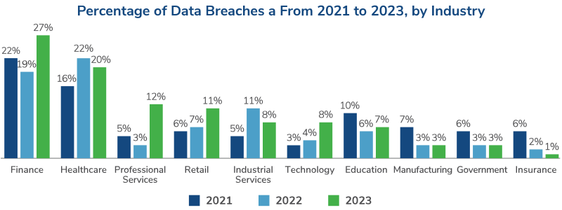

# DevSecOps Bootcamp - Day 1: Introduction to DevSecOps and Security Fundamentals

Welcome to Day 1 of the DevSecOps Bootcamp! This day is all about setting the foundation by understanding the importance of security, identifying key risks, and exploring the transition from traditional DevOps to DevSecOps.

### 1️⃣ Importance of Security

#### Why It Matters

Security is no longer an optional enhancement—it’s a core business enabler. A single breach can compromise sensitive data, cause financial losses, and erode customer trust.

- **Financial Losses**: The average cost of a data breach in 2023 was $4.45 million (IBM Report).
- **Compliance Risks**: Non-compliance with GDPR, HIPAA, or PCI DSS can lead to heavy fines.

**Data Breaches in Recent Years:**

### 2️⃣ Top 10 Web Application Security Risks

#### Overview

Web applications are the front door to your organization, and attackers actively exploit known vulnerabilities. The OWASP Top 10 offers a comprehensive guide to common risks:

# OWASP Top 10 Security Risks

| Rank | Risk Name                               | Insight                                                                 |
|------|-----------------------------------------|-------------------------------------------------------------------------|
| 1    | Broken Access Control                   | Attackers exploit flaws to access unauthorized resources.               |
| 2    | Cryptographic Failures                  | Sensitive data exposure due to weak or missing encryption.              |
| 3    | Injection                               | Malicious data sent to an interpreter, leading to unintended execution. |
| 4    | Insecure Design                         | Flaws in design that lead to exploitable vulnerabilities.               |
| 5    | Security Misconfiguration               | Incorrectly configured security settings allow unauthorized actions.    |
| 6    | Vulnerable and Outdated Components      | Use of components with known vulnerabilities.                           |
| 7    | Identification and Authentication Failures | Weak authentication mechanisms allow unauthorized access.             |
| 8    | Software and Data Integrity Failures    | Code and data tampering due to lack of integrity checks.                |
| 9    | Security Logging and Monitoring Failures | Inadequate logging and monitoring allow undetected breaches.           |
| 10   | Server-Side Request Forgery (SSRF)      | Attackers manipulate server-side requests to access internal resources. |

**Example for SQL Injection:**

Above, the SQL command deletes a table due to lack of input sanitization.

**Dynamic Activity:**

- Ask Students to Identify Flaws: Present a piece of vulnerable code and ask them to pinpoint the issue.
- Tool Demo: Show how a tool like Burp Suite identifies vulnerabilities.

**Suggested Visual:**

- A risk radar diagram categorizing risks by likelihood and impact.

### 3️⃣ How to Secure Systems Against Attacks

#### Best Practices:

- **Encrypt All Data**: Use HTTPS to protect communication.
- **Least Privilege**: Limit access to only what’s necessary.
- **Patch Regularly**: Apply security updates immediately.

**Dynamic Insight:**

- Share a recent security vulnerability in popular software (e.g., Log4Shell) and demonstrate how regular patching could have mitigated it.

**Real-World Example:**

- Amazon secures its API endpoints by using token-based authentication and rate limiting to prevent abuse.

**Suggested Visual:**

- Diagram: Secure configurations using a layered approach: input sanitization, firewalls, and encryption.

### 4️⃣ Definition and Importance of DevSecOps

#### What is DevSecOps?

DevSecOps embeds security practices into the DevOps pipeline, ensuring vulnerabilities are detected and fixed early in the development lifecycle.

**Key Benefits:**

- **Cost-Efficient Fixes**: Fixing issues during development is 6x cheaper than in production.
- **Team Collaboration**: Developers, operations, and security teams work in unison.

**Dynamic Insight:**

- Discuss the cultural shift required to adopt DevSecOps. Encourage students to share experiences with "security late in the pipeline."

**Suggested Visual:**

- DevSecOps Infinity Loop: Security intertwined with CI/CD processes.

### 5️⃣ Traditional DevOps vs DevSecOps

| Aspect               | DevOps                      | DevSecOps                           |
|----------------------|-----------------------------|-------------------------------------|
| Focus                | Speed and Automation        | Speed, Automation, and Security     |
| Security Stage       | End of the pipeline         | Integrated at every stage           |
| Responsibility       | Security team               | Shared responsibility (all teams)   |

**Dynamic Insight:**

- Discuss how early security reduces mean time to recovery (MTTR) in production.

**Real-World Use Case:**

- Netflix adopted DevSecOps with automated vulnerability scanning in its CI/CD pipeline, reducing deployment delays.

**Suggested Visual:**

- Pipeline Comparison: A diagram showing traditional DevOps vs DevSecOps workflows.

### 6️⃣ Roles & Responsibilities in DevSecOps

#### Who Does What?

- **Developers**:
  - Write secure code.
  - Run static application security testing (SAST) tools.
- **Ops Teams**:
  - Secure deployment environments (e.g., containerized apps).
- **Security Teams**:
  - Define and enforce security policies.

**Dynamic Activity:**

- Assign students a mock scenario (e.g., handling a data breach). Ask them to discuss how each role contributes to resolving the issue.

**Suggested Visual:**

- Venn Diagram: Overlapping responsibilities between developers, ops, and security teams.

### 7️⃣ How Layered Security Works

#### What is Layered Security?

Also known as defense-in-depth, layered security combines multiple independent defenses to reduce vulnerabilities at different levels.

**Key Layers:**

- **Perimeter Layer**: Firewalls, VPNs.
- **Application Layer**: Input validation, strong authentication.
- **Data Layer**: Encryption, secure backups.

**Dynamic Insight:**

- Discuss the analogy of a bank’s security system:
  - Guards (physical).
  - Vault (logical security).
  - Cameras (monitoring).

## 📚 Official Resources

- [OWASP Top 10](https://owasp.org/www-project-top-ten/)
- [CNCF DevSecOps Landscape](https://landscape.cncf.io/)
- [NIST Cybersecurity Framework](https://www.nist.gov/cyberframework)
- [Microsoft’s Security Best Practices](https://docs.microsoft.com/en-us/security/)
- [DevSecOps Handbook](https://itrevolution.com/book/devsecops-handbook/)

